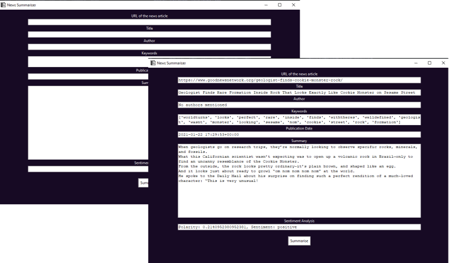

# Introduction

A news summary GUI application which provides the Title, Author, Summary and even a sentiment-judge of the news.

# Features

## Upon entering the URL of the news article, the app provides:

- Title of the article
- Author of the article
- Keywords mentioned in the article
- Publishing date of the article
- Summary of the article
- Sentiment and Polarity of the language used

## GUI features:

- Dark background (does not act as a flashbang on opening the app)
- Resizable

# How does it work?

## It uses the Python libraries **NLTK** (Natural Language Toolkit) for the language processing, **TKinter** for the GUI,**TextBlob** for sentiment detection and **Newspaper3K** for scraping the relevant data from the news articles.

# Clone project

`git clone https://github.com/AdityaBhattacharya1/News-Summariser`  

`cd` into the directory  

`pip install -r requirements.txt`  

`python main.py`
